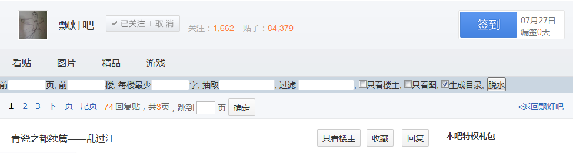
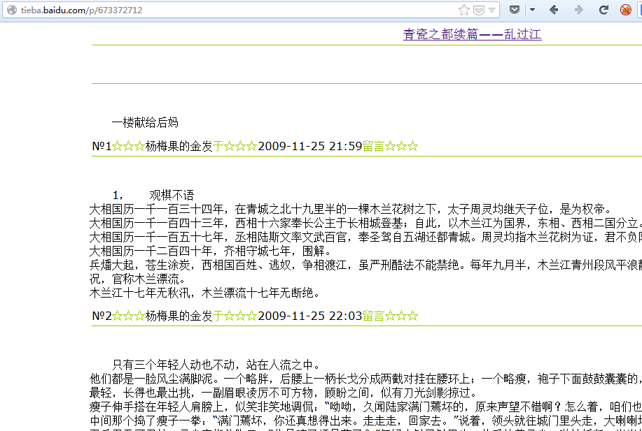

tieba_dewater
===================

百度贴吧 贴子脱水

安装：http://userscripts.org/scripts/show/443517

结合 [Save Back to File from DOM](https://addons.mozilla.org/zh-CN/firefox/addon/save-back-to-file-from-dom/?src=api) 扩展就可以保存脱水后的贴子到本地

以 飘灯 贴吧 的 [乱过江](http://tieba.baidu.com/p/673372712) 为例

贴子内添加脱水按钮

脱水后的贴子

